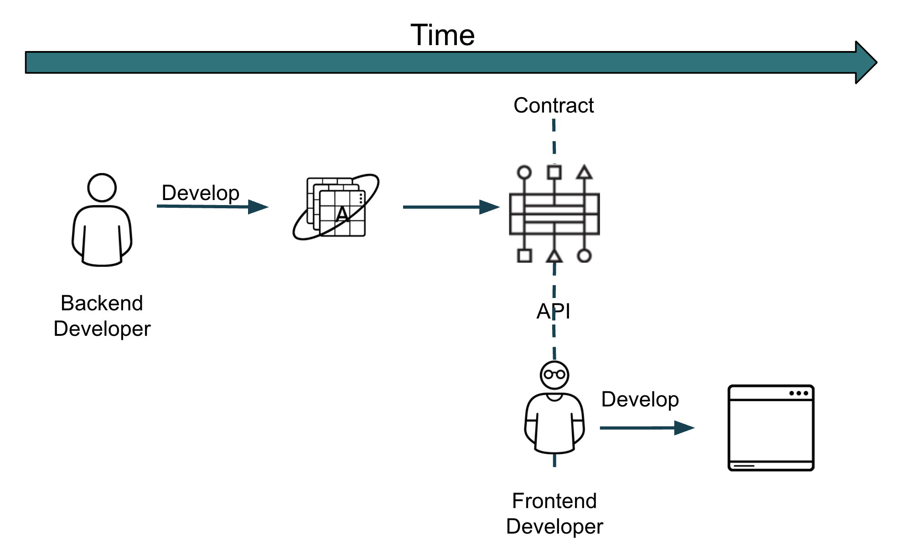

:data-uri:
:noaudio:

== Code First

* Backend Developer creates code
* Backend Developer iterates development
* Backend Developer create API Contract
* Frontend Developer uses API

ifdef::showscript[]

Transcript:

endif::showscript[]
