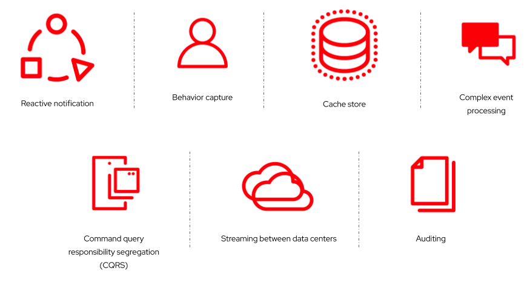

:data-uri:
:noaudio:

== Event-Driven Architecture Use Cases

* Event-Driven Architecture can be applied to the following use cases:

ifdef::showscript[]

Transcript:

Reactive notification 
EDA allows events to quickly reach the targeted service and systems to react upon changes in state. These changes can be pushed to any AI system or can be bubbled up to other applications.  Organizations can quickly respond to incidents, preempt potential issues, identify trends, and provide better services to customers.

Command query responsibility segregation (CQRS)
CQRS separates the input/update and query services with different access interfaces.  Event driven architecture is an ideal approach to implement CQRS, as you can easily separate the query and result models into different channels.    Caching can be introduced to speed up the read/output effort.

Behavior capture
Using the  large amounts of data that organizations capture, business behavior can be extracted and tracked to predict  potential future behavior, informing strategy and planning.

Auditing
All the changes of state in a system can be stored, at every step,inlog files. Change  logs provide a valid capability for auditors to trace system changes at any point in time.

Complex event processing
In this use case, multiple and/or complex events combined in a certain business criteria can trigger a business process or decision. 

Cache store
In this scenario, the logging of  events in an in-memory cache can become a temporary data store for services to retrieve the latest state without needing to access the actual backend data store.

Streaming between data centers
Large enterprises often have multiple clusters of clouds across various geographies for high-availability, redundancy, backup or disaster recovery. Events can be broadcast across multiple geographies to allow instant inquiries, and make real-time decisions.

endif::showscript[]
