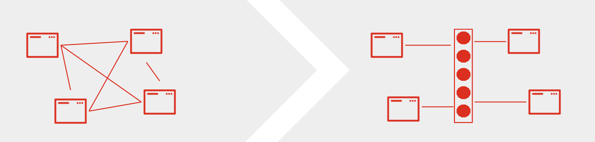

:data-uri:
:noaudio:

== Microservices Async Communications

* Async communication is the foundation for event-driven Microservices

* High availability: No dependency on other services
* Autonomy in services with independent evolution  

ifdef::showscript[]

Transcript:

endif::showscript[]
