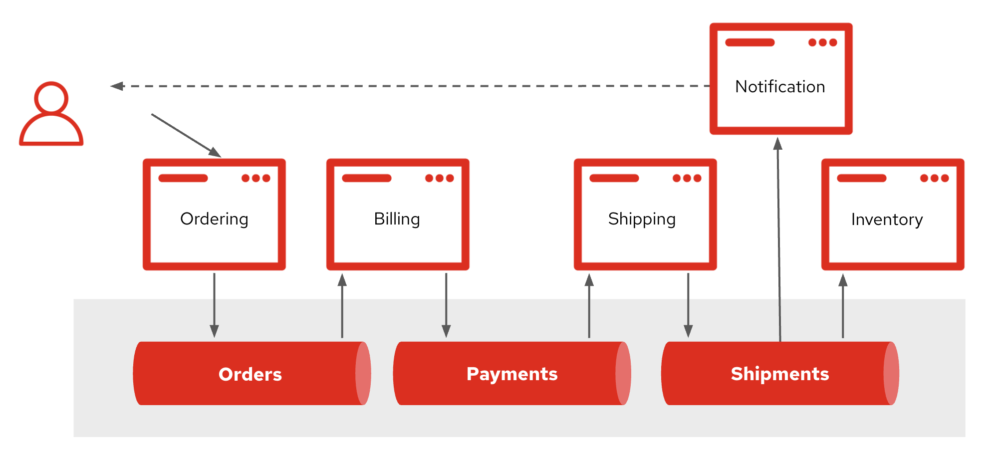

:data-uri:
:noaudio:

== Event-driven Microservices

* Decoupled nature of event handling is at the heart of event-driven microservices

* Messaging provides the ability to do advanced distributed actions
** Flow control, delivery guarantees, persistence for high availability

ifdef::showscript[]

Transcript:

This decoupled nature of event handling is at the heart of event-driven microservices.

Event-driven microservices pass messages through messaging middleware to communicate amongst the services, thereby decoupling the components and allowing events to be observed, recorded, and acted upon. The messaging backend provides the ability to do advanced distributed actions like flow control, delivery guarantees, and persistence for high availability.

endif::showscript[]
