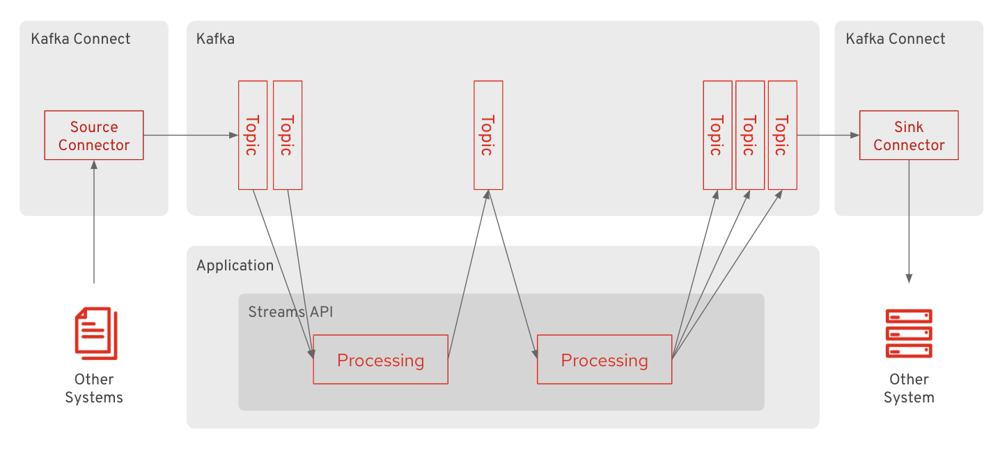

:data-uri:
:noaudio:

== Kafka Connect And Kafka Streams API

* Kafka Connect is a tool for scalably and reliably streaming data between Apache Kafka and other systems 
** It makes it simple to quickly define connectors that move large collections of data into and out of Kafka 

* Kafka Streams API is a client library for building applications and microservices
** The input and output data are stored in Kafka clusters 

ifdef::showscript[]

Transcript:
Kafka Connect is a tool for scalably and reliably streaming data between Apache Kafka and other systems. It makes it simple to quickly define connectors that move large collections of data into and out of Kafka. Kafka Connect can ingest entire databases or collect metrics from all your application servers into Kafka topics, making the data available for stream processing with low latency. An export job can deliver data from Kafka topics into secondary storage and query systems or into batch systems for offline analysis.

Kafka Connect features include:

A common framework for Kafka connectors - Kafka Connect standardizes integration of other data systems with Kafka, simplifying connector development, deployment, and management
Distributed and standalone modes - scale up to a large, centrally managed service supporting an entire organization or scale down to development, testing, and small production deployments
REST interface - submit and manage connectors to your Kafka Connect cluster via an easy to use REST API
Automatic offset management - with just a little information from connectors, Kafka Connect can manage the offset commit process automatically so connector developers do not need to worry about this error prone part of connector development
Distributed and scalable by default - Kafka Connect builds on the existing group management protocol. More workers can be added to scale up a Kafka Connect cluster.
Streaming/batch integration - leveraging Kafka's existing capabilities, Kafka Connect is an ideal solution for bridging streaming and batch data systems

Kafka Streams is a client library for building applications and microservices, where the input and output data are stored in Kafka clusters. It combines the simplicity of writing and deploying standard Java and Scala applications on the client side with the benefits of Kafka's server-side cluster technology.

endif::showscript[]
