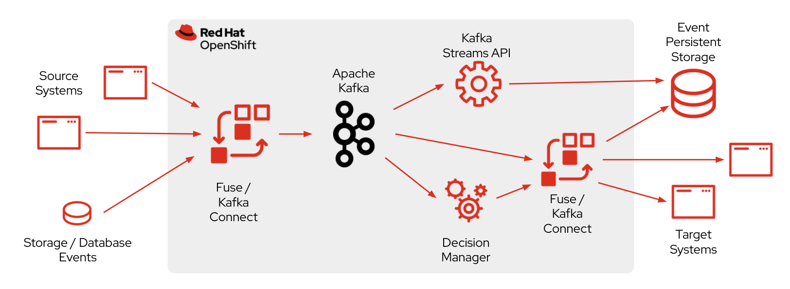

:data-uri:
:noaudio:

== Kafka Event Processing

* Kafka can process data in processing pipelines consisting of multiple stages

* Where raw input data is consumed from Kafka topics 
** Then aggregated, enriched, or otherwise transformed into new topics 
** Messages are then made available for further consumption or follow-up processing 

ifdef::showscript[]

Transcript:

endif::showscript[]
