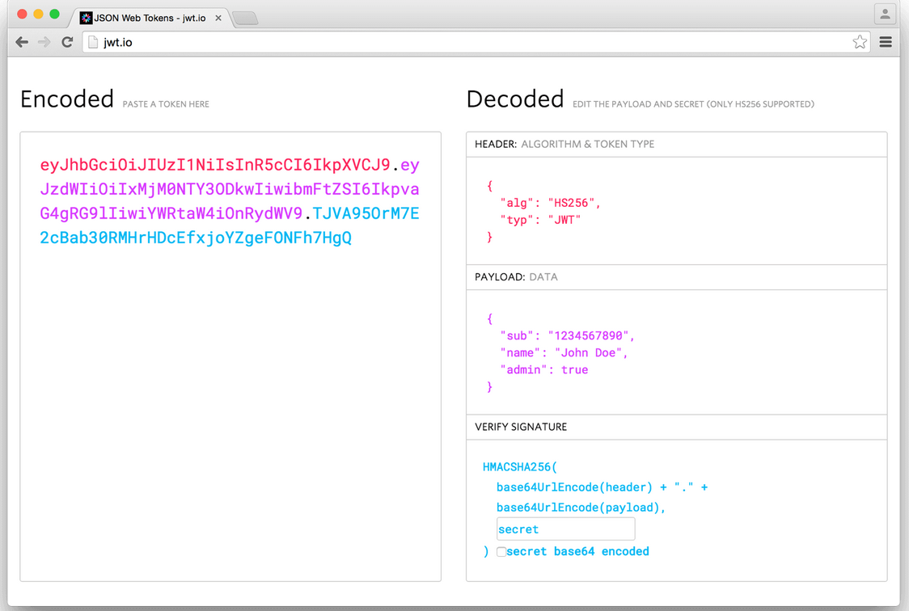

:data-uri:
:noaudio:

== OIDC Profile

* OIDC Flow adds a openid scope in addition to the profile
* Final step: exchange of authorization code for access token and ID token
* ID token is Java Web Token (JWT)
** 3 parts seperated by dots
** header, payload, signature

ifdef::showscript[]

Transcript:

endif::showscript[]

