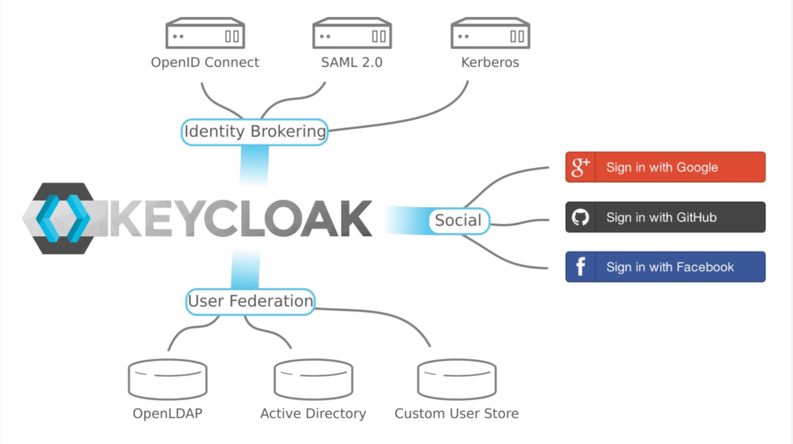

:data-uri:
:noaudio:

== SSO Identity Brokering and User Federation

* Capable of brokering authentication on behalf of clients
* Based on OIDC and SAML
* Support for federated authentication in a variety of contexts

ifdef::showscript[]

Transcript:

endif::showscript[]
