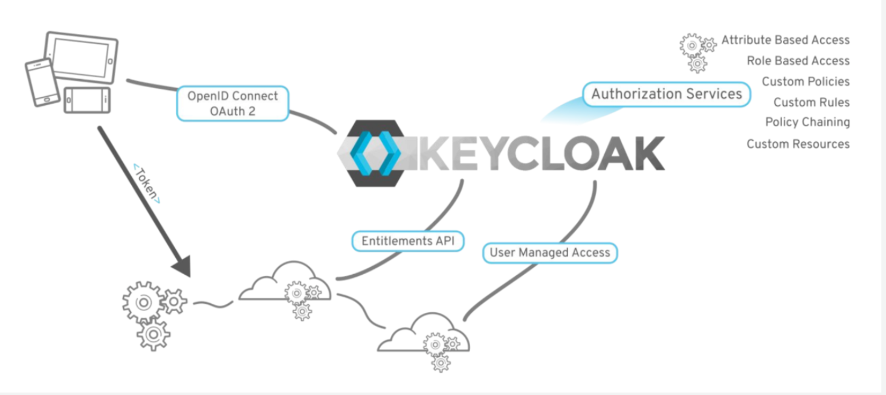

:data-uri:
:noaudio:

== SSO Central Authorization

* RH-SSO supports fine-grained authorization policies
* Based on admin and REST APIs
* Provides necessary means to:
** Create permissions for protected resource
** Associate those premissions with authorization policies
** Enforce authorization decisions in servers and applications

ifdef::showscript[]

Transcript:

endif::showscript[]
