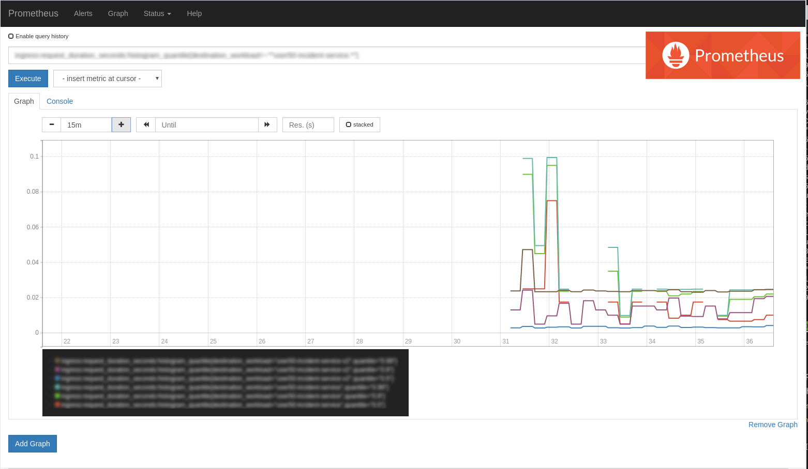

:data-uri:
:noaudio:

== Gathering Microprofile Metrics

* Metrics are exposed on well-known REST endpoints that are defined by MicroProfile Metrics to review the metrics data collected. 

* Monitoring agents such as Prometheus can access these endpoints to collect metrics.

* Configure Prometheus to scrape the metrics for your application.

ifdef::showscript[]

Transcript:

endif::showscript[]
